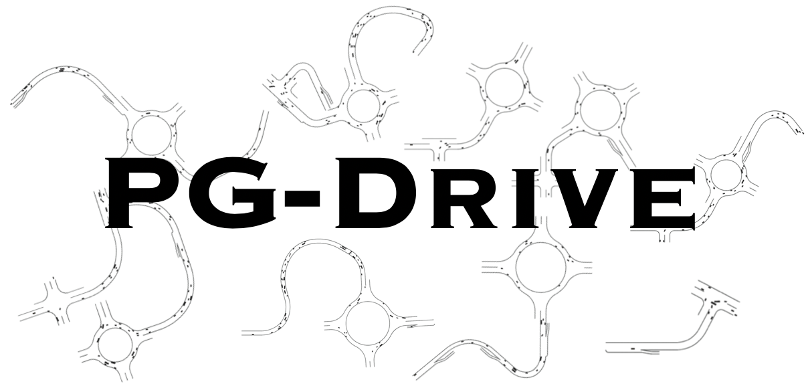

# PG-Drive: An high flexible open-ended driving simulator

Please install PG-Drive via:

```bash
pip install git+https://github.com/decisionforce/pg-drive.git@pre-release
```

or 

```bash
git clone https://github.com/decisionforce/pg-drive.git
cd pg-drive
git checkout pre-release
pip install -e .
```

## Quick Start

Please run `python -m pg_drive.examples.test_generalization_env` to play with the environment with keyboard!

To build the environment, you can simply run:

```python
import pg_drive  # Import this package to register the environment!
import gym

env = gym.make("GeneralizationRacing-v0", config=dict(use_render=True))
env.reset()
for i in range(1000):
    obs, reward, done, info = env.step(env.action_space.sample())
    env.render()
    if done:
        env.reset()
env.close()
```


## Predefined environment sets

| Index | Name     &nbsp; &nbsp; &nbsp; &nbsp; &nbsp; &nbsp; &nbsp; &nbsp; &nbsp; &nbsp; &nbsp;  | Random Seed Range | Number of Maps | Comments                                                |
| ----- | ----------------------- | ----------------- | -------------- | ------------------------------------------------------- |
| 1     | `PGDrive-test-v0`       | [0, 200)          | 200            | Test set, not change for all experiments.               |
| 2     | `PGDrive-validation-v0` | [200, 1000)       | 800            | Validation set.                                         |
| 3     | `PGDrive-v0`            | [1000, 1100)      | 100            | Default training setting, for quick start.              |
| 4     | `PGDrive-training0-v0`  | [3000, 4000)      | 1000           | First set of 1000 environments.                         |
| 5     | `PGDrive-training1-v0`  | [5000, 6000)      | 1000           | Second set of 1000 environments.                        |
| 6     | `PGDrive-training2-v0`  | [7000, 8000)      | 1000           | Thirds set of 1000 environments.                        |
| ...   |                         |                   |                | *More map set can be added in response to the requests* |
