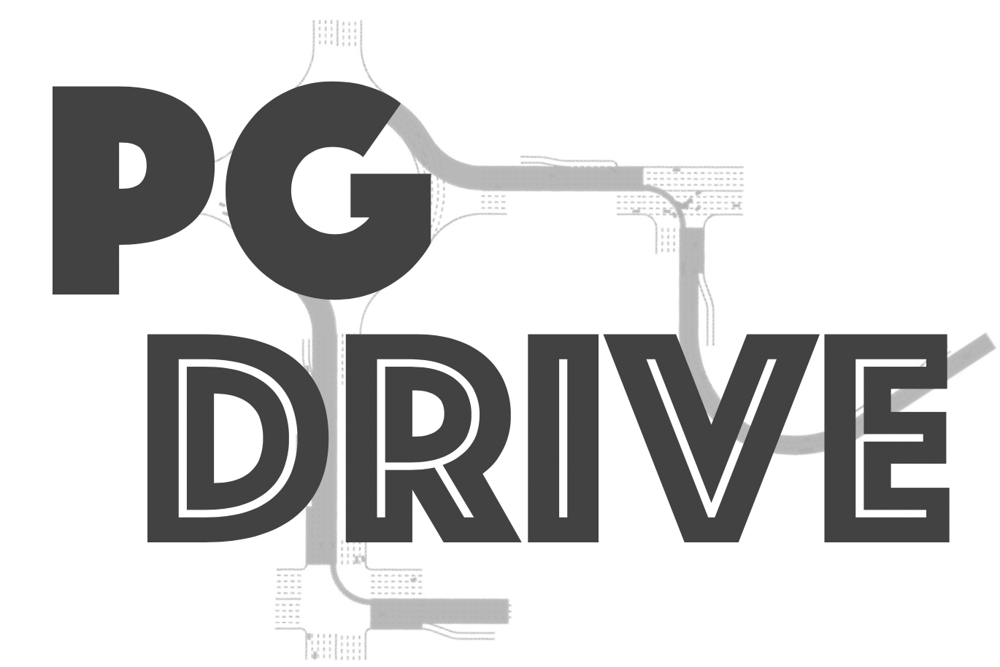

#####################
PGDrive Documentation
#####################

Welcome to the PGDrive documentation. PGDrive is an open-ended driving simulator with infinite scenes. The key features of PGDrive includes:

- **Lightweight**: Extremely easy to install and run in almost all platform.
- **Accurate**: Accurate physics simulation allows realistic dynamics.
- **Efficient**: Up to 500 simulation step per second.
- **Open-ended**: Can generate infinite scenes.

This documentation let you get familiar with the installation and basic utilization of PGDrive. Please go through :doc:`install` and enjoy PGDrive!

Table of Content
################
.. toctree::
   :maxdepth: 2
   :caption: Quick Start

   install.rst
   getting_start.rst

.. toctree::
   :maxdepth: 2
   :caption: Environment Config

   generalization_env_config.rst

